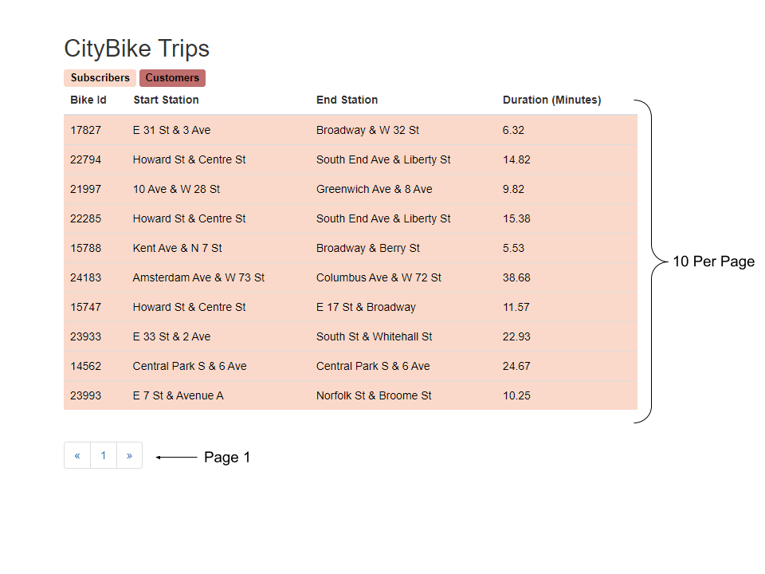

# CityBike Database Website

### Languages and Tools Used:

 


### How to use

The backend is already configured and uploaded to Heroku, the front-end therefore is already linked and has full backend functionality. To view the project you will just download the front end and view the index.html file within your local browser.

### About

This project was done to create a full-stack website using framework ExpressJS, and Mongoose/MongoDB Atlas for database management. Below you will see the link to the back-end, it contains all of the JSON sample data on the MongoDB Atlas server and was uploaded to Heroku with the routes available for handling request and response data.

The Live Demo of the Backend: https://mighty-garden-03764.herokuapp.com/api/trips?page=1&perPage=10

### Trip queries that are available on the backend website:
- - - -

<pre>/api/trips/:id</pre>
- - - -
Returns the sample data that contains the ID specified in the API call. For example `/api/trips/572bb8222b288919b68abf69` will return JSON data:

```
{
  "message": {
    "start station location": {
      "type": "Point",
      "coordinates": [
        -73.993915,
        40.746647
      ]
    },
    "end station location": {
      "type": "Point",
      "coordinates": [
        -73.97809472,
        40.736502
      ]
    },
    "_id": "572bb8222b288919b68abf69",
    "tripduration": 1245,
    "start station id": 442,
    "start station name": "W 27 St & 7 Ave",
    "end station id": 545,
    "end station name": "E 23 St & 1 Ave",
    "bikeid": 24071,
    "usertype": "Subscriber",
    "birth year": 1970,
    "start time": "2016-01-01T00:08:17.000Z",
    "stop time": "2016-01-01T00:29:03.000Z"
  }
}
```
- - - -
<pre>/api/trips?page=[NUMBER]&perPage=[NUMBER]</pre> 
- - - -
Returns a json message of the sample data by page and the amount per page. For example `/api/trips?page=1&perPage=10` will return page number 1 with 10 data points. example can be seen below:



